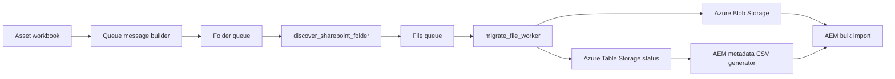

# Architecture

This demo repository models a controlled asset migration from SharePoint to a DAM ingestion area in Azure Blob Storage, followed by an AEM bulk metadata import.

## Flow

## Design Choices

- Folder discovery and file transfer are separated into different queues so large folders can be expanded without blocking file workers.
- The destination blob path is normalized before upload to avoid DAM-incompatible characters and unstable folder names.
- Source metadata and normalized destination paths are persisted to Table Storage for audit and CSV generation.
- AEM metadata generation is handled as a separate step so inventories and exceptions can be reviewed before import.
- Zero-byte and known transient file types are excluded from AEM metadata generation to avoid import failures for assets AEM will not materialize.

## Environment Assumptions

- SharePoint host: `contoso.sharepoint.com`
- Resource group: `rg-demo-dam`
- Function App: `sp-dam-migration-worker`
- Storage account: `demodamstorage`
- Blob container: `demo-dam-migration`
- AEM root: `/content/dam/demo`
